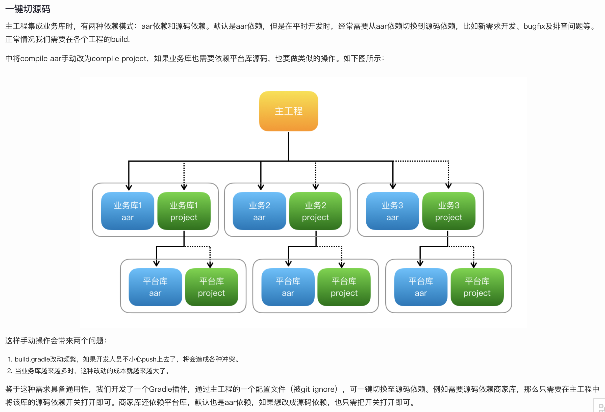

## 绿豆荚

[  ](https://bintray.com/jackyjacky/maven/greenbean-pods-plugin/0.0.1/link)

#### 绿豆荚是什么？

绿豆荚的起源是主工程中需要依赖大量的内部maven仓库，通常会有几十个。这时就有一个问题，如果主工程中maven仓库需要升级或者修复问题，那该怎么操作？一般就是先在maven仓库的git repo中修改，然后发布到内网的maven中心，然后再在主工程中升级maven仓库版本号，再验证问题是否修复，以及功能是否满足需求。

这么长的流程经常出现，那我们能不能直接在主工程中修改maven仓库？修复、发布功能的同时能直接在主工程验证？在[美团外卖架构演进](https://tech.meituan.com/2018/03/16/meituan-food-delivery-android-architecture-evolution.html)文章中有讲到类似的问题，如下：



绿豆荚依赖管理器可以一键把线上的aar依赖切换为本地依赖，实现类似iOS cocoapods依赖管理器直接依赖仓库源码。

#### 用法

在setting.gradle中添加：

```groovy
buildscript {
    repositories {
        jcenter()
    }
    dependencies {
        classpath 'tech.jackywang:greenbean-pods-plugin:0.0.1'
    }
}

apply plugin: 'greenbean-pods-plugin'
```

在build.gradle中添加：

```groovy
buildscript {
    // ...
    dependencies {
        classpath 'tech.jackywang:greenbean-pods-plugin:0.0.1'
    }
}

allprojects {
    apply plugin: 'greenbean-pods-plugin'
    // ...
}
```

新建文件夹：greenbean.pods，然后新建配置文件：PodsSpec.groovy，内容如下：

```groovy
import greenbean.pods.GreenBean

@groovy.transform.BaseScript GreenBean pods

/**
 * 依赖描述文件
 * <pre>
 * {@code
 * pod{
 * on_off //模块开关
 * name   //模块名称
 * group  //模块Group
 * path   //模块本地路径，仅支持本工程父目录向下扩展
 * branch //模块仓库分支，根据path切换分支
 * cmd //命令hook，在include之前执行
 * excludes //模块的线上依赖名称
 * buildTypes //模块的构建类型
 * seeds //模块依赖的子模块，必须与子模块的name字段匹配
 *}*}
 * </pre>
 */

// 以下为示例内容，如果想动态调试app模块中的名为‘greenbean-pods-plugin-test-module’的线上模块，则先配置如下。
pod {
    on_off true
    name 'greenbean-pods-plugin-test-module'
    group 'tech.jackywang'
    path 'test-module/library'
}

pod {
    on_off true
    name 'app'
    seeds 'greenbean-pods-plugin-test-module'
}
```

配置完成，sync整个工程，线上模块将会以源码的方式包含进工程，实现源码调试模块的能力。


